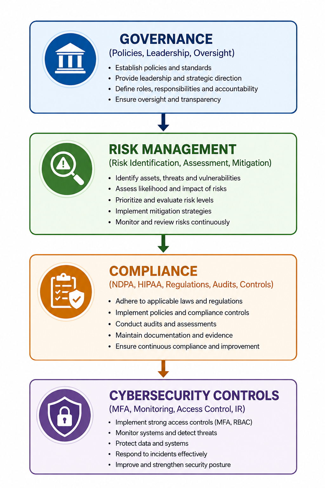
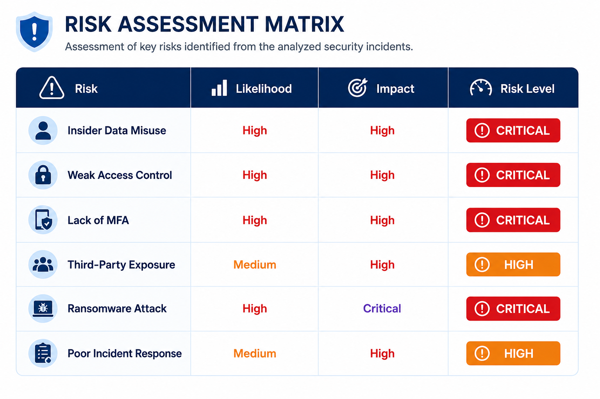

# GRC-Incident-Analysis
# Comparative Security Incident Analysis (GRC Case Study)

## Overview
This project presents a comparative analysis of two major cybersecurity incidents that occurred within the last three years:

- NIMC Data Exposure (Nigeria)
- Change Healthcare Ransomware Attack (USA)

The analysis focuses on Governance, Risk, and Compliance (GRC) principles, examining how weak security governance, poor access controls, regulatory gaps, and inadequate risk management contributed to both incidents.

The project was completed as part of a cybersecurity and compliance-focused academic exercise using publicly available information.

---

# Objectives
The primary objectives of this project are to:

- Analyze real-world cybersecurity incidents
- Evaluate governance and compliance failures
- Assess organizational security controls
- Understand regulatory implications
- Identify root causes and control weaknesses
- Recommend remediation and risk mitigation strategies

---

# Key Areas Covered
- Governance, Risk & Compliance (GRC)
- Data Protection & Privacy
- Incident Response
- Insider Threats
- Access Control Failures
- Ransomware Attacks
- Third-Party Risk
- Security Governance
- Risk Assessment
- Regulatory Compliance

---

# Incidents Analyzed

## 1. NIMC Data Exposure (Nigeria)
The National Identity Management Commission (NIMC) incident involved the unauthorized exposure of sensitive National Identification Number (NIN) data belonging to Nigerian citizens.

### Focus Areas
- Data privacy concerns
- Insider threat risks
- Weak access control mechanisms
- Third-party governance challenges
- NDPA & NDPR compliance implications

---

## 2. Change Healthcare Ransomware Attack (USA)
The Change Healthcare incident was a large-scale ransomware attack that disrupted healthcare systems across the United States.

### Focus Areas
- Lack of Multi-Factor Authentication (MFA)
- Ransomware operations
- Healthcare infrastructure disruption
- HIPAA compliance failures
- Incident response and resilience

---

# GRC Framework Diagram

---

# Risk Assessment Matrix

---

# Technologies / Frameworks Referenced
- NDPA (Nigeria Data Protection Act)
- NDPR (Nigeria Data Protection Regulation)
- HIPAA Security Rule
- HITECH Act
- NIST Cybersecurity Framework (CSF)
- Zero Trust Security Model

---

# Repository Structure

grc-incident-analysis/
│
├── README.md
├── reports/
│   └── Comparative_Incident_Analysis.pdf
│
├── images/
│   ├── grc-framework.png
│   └── risk-assessment-matrix.png

---

# Skills Demonstrated
- Cybersecurity Incident Analysis
- Governance, Risk & Compliance (GRC)
- Risk Assessment
- Security Governance
- Technical Documentation
- Compliance Analysis
- Security Research
- Incident Response Evaluation

---

# Key Lessons Learned
- Cybersecurity is a governance issue, not just a technical issue
- Weak access controls significantly increase organizational risk
- MFA remains one of the most critical security controls
- Third-party risk management is essential
- Regulatory compliance must be continuously enforced
- Organizations must adopt proactive cyber resilience strategies

---

# References
Full references and citations are included in the PDF report located in the `reports/` directory.

---

# Disclaimer
This project was created strictly for academic and educational purposes using publicly available information. No confidential or proprietary organizational data was used.

---

# Author
Ebere Emilia Ikechukwu

Cybersecurity | GRC | Risk Management | Compliance | Information Security
